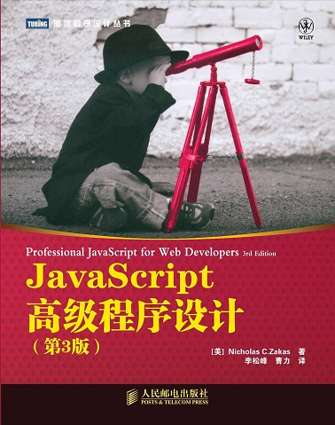
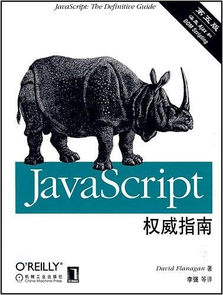
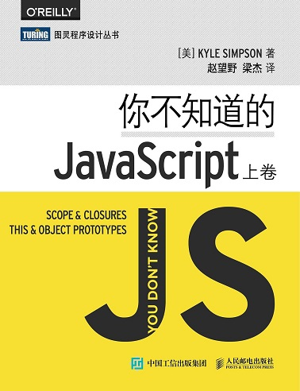
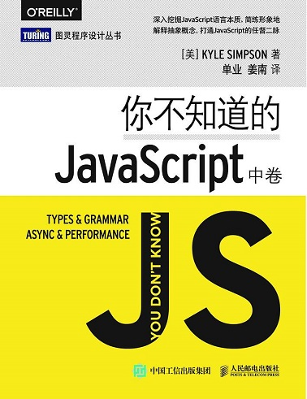
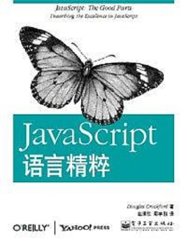
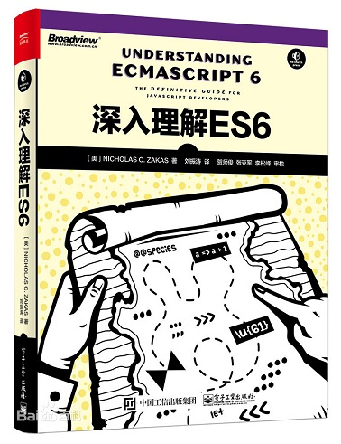
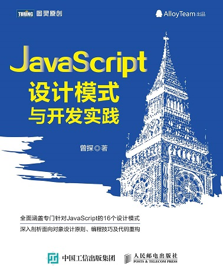
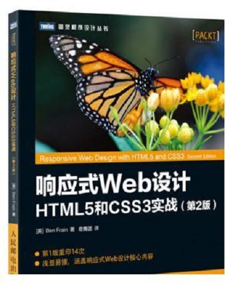
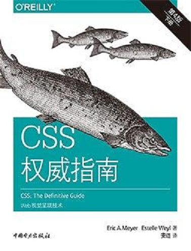
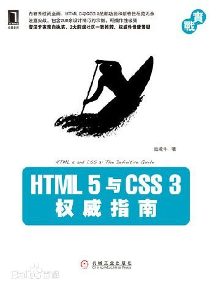

# 那些年读过的前端书籍:books:资源分享（超赞！:boom:）

:clap:欢迎转载，但请著明转载来源:point_right:：https://github.com/ZhengMaster2020/FEBooks

### 1.  JavaScript的必看的经典书籍

+ **《JavaScript高级程序设计》（第三版） 传说中的红宝书**

  

  

  > PDF文件下载链接: https://pan.baidu.com/s/1Rx9N8xyX7hNbEIezeQz_GQ  提取码: **i47r** 

  

+ **《JavaScript权威指南》 （第六版） 传说中的js圣经**

  

  > PDF文件下载链接: https://pan.baidu.com/s/1FYua8MG-3rhqJ0IwP34MoA 提取码: **arbt**

  

+ **《你不知道的JavaScript》（上卷）**

  

  > PDF文件下载链接: https://pan.baidu.com/s/1mPVRBY9m-HV8da1H-KYH1A  提取码: **pyer** 

  

+ **《你不知道的JavaScript》（中卷）**

  

  > PDF文件下载链接: https://pan.baidu.com/s/1Y7553bvryPOvNCBk9YVTDw 提取码: **dser**

+ **《你不知道的JavaScript》（下卷）**

  

  > PDF文件下载链接: [https://pan.baidu.com/s/1NkZuPzEHZU6B_E-sR8mmpA](https://pan.baidu.com/s/1NkZuPzEHZU6B_E-sR8mmpA)  提取码: **c3gr** 
  
+ **《JavaScript语言精髓》**

> PDF文件下载链接: **https://pan.baidu.com/s/1dvC4GasgAyFLUZSZ99JnvA**  提取码: **76yk** 

+ **《ES6标准入门》**

  

  > PDF文档下载链接: **https://pan.baidu.com/s/1nQgSF-iIL3h7aDnNbBcSfw**  提取码: **kqtv** 
  >
  > 本书在线阅读：**http://es6.ruanyifeng.com/**

+ **《深入理解ES6》**

  

  > PDF文档下载： 
  >
  > 链接: **https://pan.baidu.com/s/1x7iZobeweglpWEd_KQ7t0A**  提取码: **12xb** 

+ **《JavaScript设计模式与开发实践》**

  

  > PDF文档下载
  >
  > 链接: **https://pan.baidu.com/s/1LX1PuoMyUQ0giBaX_xD2sQ**  提取码: **cin5** 

+ **《Typescript教程入门指南》**

  

  > 线上阅读链接： http://ts.xcatliu.com/
  >
  > PDF文档下载：
  >
  > 链接: https://pan.baidu.com/s/1Yt3JTVv2jfQjmPVFc22XbQ  提取码: **vghm**

+ **《Learning TypeScript 中文版》**

  

  > PDF文档下载
  >
  > 链接: https://pan.baidu.com/s/1Z4-TtppBlxRFCy53BLTfYg  提取码: **ipv2**

  

+ 《数据结构与算法》 JavaScript描述版

> PDF文档下载：
>
> 链接: **https://pan.baidu.com/s/1Fkj41FhcJowVZ3MIiz7A3Q**  提取码: **yqhn** 

 ### 2. HTML与CSS的入门到放弃的书籍

 + **《Head First HTML与CSS 第2版》**

   

   > PDF文档下载链接：**http://www.java1234.com/a/javabook/webbase/2016/0725/6452.html**

 + **[图灵程序设计丛书].《响应式Web设计：HTML5和CSS3实战》第2版**

   

   > PDF文档下载链接：	**http://pan.baidu.com/s/1cByAT4    密码：c6ox**

+ **《CSS权威指南》**

> PDF文档下载链接：**https://pan.baidu.com/s/1idTAxUyIIYkDjOiq8J0PsQ** 
> 提取码：**6mzf** 

+ **《HTML.5与CSS.3权威指南》**

  

> PDF文档下载链接: **https://pan.baidu.com/s/16ou7W0ic0hiz8T-OjQA9mw** 
>
> 提取码: **fpej** 

+ 《图解CSS》

  

> PDF文档下载链接：**https://pan.baidu.com/s/1jGUpKb0**

### 3. js火爆的前端框架Vue与React深入学习书籍

+ **《Vue.js权威指南》**

  

  > PDF文档下载链接: **https://pan.baidu.com/s/1iYnj8SwdKmDHaWgouVWivA**
  >  密码：**nnao**

+ **《Vue.js实战》**

  

  > PDF文档下载：
  >
  > **链接：https://www.jb51.net/books/612751.html**

+ **《Vue.js 前端开发 快速入门与专业应用》**

  

  > PDF文档下载：
  >
  > **链接：[![YPSuperKey Unlocked](data:image/png;base64,iVBORw0KGgoAAAANSUhEUgAAADAAAAAwCAYAAABXAvmHAAAABHNCSVQICAgIfAhkiAAAAAlwSFlzAAADYgAAA2IByzwVFAAAABx0RVh0U29mdHdhcmUAQWRvYmUgRmlyZXdvcmtzIENTNui8sowAAAb7SURBVGiB7ZlrbFTHFcd/M/fu2uvXetcG24ChvIt4mHcIaUlaNVJRH6nUV1K1kapKkSqlVdu0pUqrSG1p+yFIUZt8SdqqrdKWUIkIpZQgEgKYQIAkxhTiAPHbXvxk117vrr17H6cf1jaFALtr8PpL/tKV7p2dc+b855w5c2ZWiQgzBaXUJuAbQB2wGvACl4GzwB4ROZxRiYjk/QHuBV4GegEBpMxfLoFgUAzDkPG2MHAE+CZg3EqXmgEPmKvXrj8c6urctuUT2/js5x9iwaLFlJX60YYmHo/R1dFB/eFDvPbqfgb6+wDeBR4TkYYPacvjrG8FGp781e+aLoYi8mbjJWkdjMuVmCtXYiKhmCuhEWf825WuqCVvnW+Wx3+0Q7xerwBx4Osz4gGl1DrgjUKfr/wvL+1j4z1bMDweUmNJzp9roOHt03S2t+I6LnNr51O3YRNr12/EXx5Aa039kdd54rvfoedKCOALIrI/bx4ASoD2wsJC+dM/90rrYELaBhPy0r8PydZtD0zEuwBJYHTiu279Rnn+xT3SOpiQjqGUHKg/I4FghQBRYPmk/jwQ2AXIU795WrpHbGm7mpBf7/q9mKYpgAX8EXgQWAosAj45LjMMyONP/Eya+0ekM5KUF/7+rwmy+/NCAFgIWOs33SMXQxFpvzoqf3jhbxNGXAY2ZpA9CciOp3ZK29WEdESS8rkvfXlCfms+CPwUkGf//KJ0R205ce6SBCsqhXT6nJ+FfCnQZBimvPLGCekcSsnLh46J1lqA56aVAKCAU7OqquTUe63SHbXlBzt+MTF7385Bz/2A+5VHviXtkTFp6hqUlWvWCnABKNN3mmFuAz+weOXqOqqqa4hGhzn6+kGAHmB3tkpE5BjQcKL+CP29vZSVl7Nh8xaAOcC66SRQDpRXz5mL1pro8BCd7e0AZ0VkLEddpwb6eunv7UFrg6qaOQA+YP50EggAZrCiEm0YjI2OMppIAFydgq5B27ZJJBIgQiAQBCgEqqaTgAZQWqNgIp4hvQZyRVpmQoeaNFtPJwGuG/Qa1BS03CBzTef0E5hmfERgpvERgZnGdBKIA3i8XopLDIqKiifarakq9Pl8lBQrCgoKJttMAKXUUtIbjztlc6+HACsAQl2dnKw/TVdHO67rAlQppTaMjx0Ske4s9GmAC/9txPR4aGn+4Lr2rwEJrh0s8vl0A4EsCrqf30L++yawDPA9sryWDdUBHOduOYHJHVjG35VSCGCaJnve7+BMX2Q2ac9HMqh6gfRJrIh0lBjAFWCfCaQAHl42jy+uXwJjUw7R7FFUSGs4ypm+iEUWYSsiA8CzN/vNnHiJWTaMpiCZAwGtAJUuFz5cMtwaSpG8S56eWhYyNBR6cR2XkbFUOj4KvaCmUubcGczMXf4PAnhNhhJJdh5t5D8tIfoTYywqL+XRVYv43rolgIK7uI4yITcCXpO2cJQH9x6nZTgOvjIK/UHeCQ/yzpFGDrb3su+h+/BoBW5+bvyyJ6AUtuvy6KtnaBmOM3/Nfcxa8HGUNnCsJN1Nb3OgrYlfnrjAzk+tg2RqGs2+huzXgMekvq2XN3vCVCxYQc3SOlzXwbGSKMNg/pqteEuDPNNwmUg0ll4neUD2oxia98JRAAJVtTi2NZl5xHEwDBP/7LkkHKF1OJ6XsxLklIWEMq8HANtKom80UIGVSgKM98vPGsiegOWwbd4sFNDb2oRtpdCmB0QwC3zEIwMMhdpYGShhUbA0b5koewK2w8JZfp7ctJyx4QEunzzA6HAYw1NAJNTCpbcOgmvx9LY6DI+ZtyyUW6CmbHbeX8dPNiwjFu7jygdnQSlaG4+jx+Ls3r6Z7ctrc9vN7xC5ERABj8G9NUEASoPVmB4vxcFq0IoH5laCm79NDNIEvABWVgMrsF2eP9cMKMqra3Edm9nzFpNyhb++3wGmMa0G3wgNHJtX4rtcV+nPvPBMTSgc5Uj3IEWVcygo9mNbSUora8D0sudiJ6SsvNZEWkSOd/34q8+trakAy759b4/JK609pARqPrYcw/SilKawxE9w7mIar45wvi+SVy9opdSWJc/sfexCXwQ8t6kslMK1bP5xsRPQKMNkeKCbWKSf6GAPRSVlAOy+1AVm/u4KTOAzLcPxVe/2D7FqTgXYzs17asVQbJQTPWEAmk8fumm317oG+K3tpsMolzPCFDF5IvPoDHHruvh9XnZv38zF8MhNJ9kR+HTt7HQmyoPxkEs1KumD6MOrF6YLtZvZpwDLgZQ9tSvcKWCSgKlV2rBMRZjlpJ/bIVMlamj0XcpUJuNzNZKyiY0mcZMZMtFdgKEg6WSYhCyhgB8CuwIFHl3sMXHzELtaKcJjKRK2EwNWZHm5dUvUAc3MzMXWUcBzJ/+G/g/y7+AhkzE2IwAAAABJRU5ErkJggg==)https://pan.baidu.com/s/1FBKaV2ucjAKf88yEnphpBA](https://pan.baidu.com/s/1FBKaV2ucjAKf88yEnphpBA)** 
  >
  > **提取码：dyjc**

  

+ **《React全栈》**

>**链接：https://pan.baidu.com/s/1IjiWcsktJzp94P0Eo7OHoA** 
>**提取码：wsss** 

+ **《深入React技术栈》**

  

  > PDF文档下载：
  >
  > **链接：https://pan.baidu.com/s/1541DmSWVVrq68iCiifv0mQ** 
  > **提取码：i6do** 

### 4. 后端与数据库学习

+ **《Node.js权威指南》**

  

  > **链接: https://pan.baidu.com/s/1OWRyGWupgW2gkD1BghdxLw** 
  >
  > **提取码: 64iz** 

+ **《深入浅出Node.js》**

  

  > PDF文档下载：
  >
  > **链接: https://pan.baidu.com/s/1QdA8hfTl_th0OYHX3_CbWg** 
  >
  > **提取码: m5sj** 

+ **《了不起的Node.js》**

  

  > PDF文档下载：
  >
  > **链接：https://pan.baidu.com/s/1eRTb6gy**

+ **《Node.js实战》**

  

  > PDF文档下载：
  >
  > **链接: https://pan.baidu.com/s/1LeTIugTp8MTWufdJzckxZw**
  >
  >  **提取码: ab7t** 

+ 《MongoDB权威指南》

  

  > PDF 文档下载
  >
  > **链接：http://www.downcc.com/soft/301857.html**

+ 《MongoDB实战》

  

  > PDF文档下载：
  >
  > **链接：https://www.jb51.net/books/610176.html**
  >
  > **或者：https://6so.so/t/407599/**

### 5. 网络与性能优化相关书籍
+ 《图解HTTP》

  

  > PDF文档下载
  >
  > **链接: https://pan.baidu.com/s/16HN0W_7g4HNKIILuXOx7fg** 
  >
  > **提取码: km23** 

+ **《HTTP权威指南》**

  

  > PDF文档下载：
  >
  > **链接: https://pan.baidu.com/s/1hXn5Pbyr2cetH8F0rrVjuw**
  >
  > **提取码: khap** 

+ 《高性能网站建设进阶指南》

  

  > PDF文档下载： 
  >
  > **链接: https://pan.baidu.com/s/1IEsG5Ip_JDODyTSDm81W7w** 
  >
  > **提取码: nadd** 

+ **《Web性能权威指南》**

  

  > PDF文档下载
  >
  > **链接: https://pan.baidu.com/s/1o2hOTqQVIz5IqaU3YlCdjA** 
  >
  > **提取码: nbva** 

### 6. 前端工程化所需要读的书籍

+ **[图灵程序设计丛书].《GitHub入门与实践》**

> PDF 文档下载：
>
> **链接: https://pan.baidu.com/s/1HC0Ee9tqTpzx7kBS_zhwXQ** 
>
> **提取码: cyvs**

+ 《深入浅出webpack》

  

  > PDF文档下载 
  >
  > :link: **链接: https://pan.baidu.com/s/1Ezdr4ycSZVO8duZYVMjtdQ **  
  >
  > :thought_balloon:**提取码: hdmr** 

持续更新中。。。

---

温馨提示:tipping_hand_man: ：本文所有书籍均来源于网络，本篇内容不存在任何非法传播盗版书籍，  

如若有侵权请发邮件:e-mail: ：2105195274@qq.com             

Github:ghost: : **https://github.com/ZhengMaster2020/FEBooks**

我会及时删除侵权内容。:pray: **欢迎star** :star: